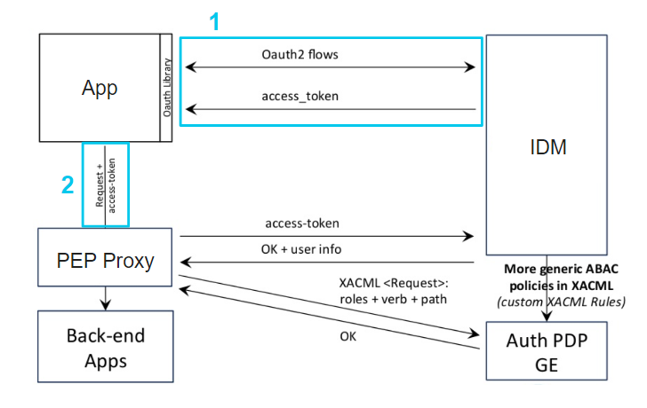

[](http://www.fiware.zone)

# Uso avanzado de la API NGSI V2

[](https://github.com/FIWARE/catalogue/blob/master/core/README.md)
[](https://fiware-ges.github.io/orion/api/v2/stable/)

**Descripción:** Este tutorial enseña a los usuarios de FIWARE una serie de 
características avanzadas del Orion Context Broker. Entre ellas se repasan:
- Tipo de datos especiales, geoespaciales y metadatos
- Operaciones por lotes
- Filtro de entidades y geoquerys
- Otras funcionalidades: Paginación, multitenencia, federación etc

El tutorial usa comandos [cUrl](https://ec.haxx.se/) en el, pero también está disponible como 
documentación Postman

[](https://documenter.getpostman.com/view/3303535/SztBbU4m)


# Autenticación
En caso de ejecutar las operaciones en modo local, empleando el context broker, no será necesario ningun tipo de autenticación.

En el de usar una plataforma con autenticación, el escenario típico de uso involucra varios elementos:
- **App**: Es la aplicación que accede a los recursos. Esto sería en el caso de este tutorial las peticiones cURL o Postman.
- **Back-end Apps**: Son los recursos protegidos. En este caso, es el Context Broker, pero podría ser cualquier elemento que requiera securización
- **IDM**: Es quien provee identificación a los usuarios
- **PEP**: Es un proxy que permite a la aplicación acceder a los recursos protegidos, por el ejemplo, el context broker
- **PDP**:

En la siguiente imagen podemos ver el esquema de los elemntos :



El proceso para autenticarnos y obtener el dato sería el siguente:

1. Solicitar el token de acceso al **IDM** con los credenciales de usuario
2. Enviar la petición que accede al dato junto con el token obtenido en el paso 1 al **PEP**  como cabecera de las peticiones con el nombre `X-Auth-Token`

## Obtención del token

Para obtener el token necesitamos enviar una petición al IDM para obtener el token. En ella debemos enviar la siguiente petición:

**Petición**

```bash
curl -iX POST 'http://localhost:15001/v3/auth/tokens' \
-H 'Content-Type: application/json' \
-d '
{
    "auth": {
        "identity": {
            "methods": [
                "password"
            ],
            "password": {
                "user": {
                    "domain": {
                        "name": "SERVICE"
                    },
                    "name": "USER",
                    "password": "PASSWORD"
                }
            }
        }
    }
}'
```

En donde hay que sustituir: 
- SERVICE: por el serivicio (Fiware-Service) al que queremos acceder
- USER: El usuario con el que queremos acceder
- PASSWORD: La contraseña del usuario

**Respuesta**

Obtendremos por parte del IDM un código de respuesta 201, siendo la respuesta algo similar a:

```http
HTTP/1.1 201 Created
Server: nginx
Date: Fri, 29 May 2020 10:34:00 GMT
Content-Type: application/json
Content-Length: 549
Connection: keep-alive
X-Subject-Token: 88d70506abb00141b3b36005a779651e
Vary: X-Auth-Token
X-Openstack-Request-Id: req-4f9922f1-5980-4971-a08a-746f1c97c189
X-Frame-Options: SAMEORIGIN
Strict-Transport-Security: max-age=31536000; includeSubdomains;
X-Content-Type-Options: nosniff
Cache-Control: no-cache, no-store, max-age=0, must-revalidate
Pragma: no-cache
Expires: 0
X-XSS-Protection: 1; mode=block
Referrer-Policy: same-origin

{
  "token": {
    "methods": [
      "password"
    ],
    "expires_at": "2020-05-29T13:34:00.917768Z",
    "extras": {
      "password_creation_time": "2019-02-20T11:33:21Z",
      "sndfa_email": false,
      "last_login_attempt_time": "2020-05-29T10:33:42.000000",
      "pwd_user_in_blacklist": false,
      "password_expiration_time": "2029-02-17T11:33:21Z"
    },
    "user": {
      "domain": {
        "id": "350afb322fe448234562728e43602421",
        "name": "SERVICE"
      },
      "id": "3533f385094503da770bab252e1ba31",
      "name": "USER"
    },
    "audit_ids": [
      "xG-DDK85abc12399QhRPw"
    ],
    "issued_at": "2020-05-29T10:34:00.917798Z"
  }
}
```

El token de autenticación que necesitamos se encuentra en la cabecera http `X-Subject-Token`

### Obtención del token mediante Postman

Postman permite definir variables de entorno y ejecutar pequeñas acciones - script - tras realizar la petición. La petición de autenticación guarda el `X-Subject-Token` en la variable `token` que se emplea como valor de la cabecera `X-Auth-Token` definida en las peticiones de la colección.


# Operaciones Básicas

En esta sección vamos a hacer un breve repaso por las operaciones básicas del curso previo, para gestionar entidades

## Crear una entidad

Para crear una entidad hay que hacer una operación `POST` a `/v2/entities` enviando en el cuerpo la entidad formateada en JSON.

Vamos a crear una entidad de tipo **Vehicle**, con el id **Vehicle:Car1** 

**Petición**

```bash
curl -iX POST 'http://localhost:1026/v2/entities' \
-H 'Content-Type: application/json' \
-d '
{
    "type": "Vehicle",
    "id": "Vehicle:Car1",
    "speed": {
        "type": "Number",
        "value": 120
    },
    "temperature": {
        "type": "Number",
        "value": 26.5
    }
}'
```
**Respuesta**:

Debemos obtener un código de respuesta 204 si la operación ha sido satisfactoria


## Obtener todas las entidades

Para comprobar si la operación anterior ha surtido efecto, podemos rescatar todas las entidades disponibles en el context broker

**Petición**

```bash
curl -X GET 'http://localhost:1026/v2/entities' 
```

**Respuesta**:
```json
[{
    "type": "Vehicle",
    "id": "Vehicle:Car1",
    "speed": {
        "type": "Number",
        "value": 120,
        "metadata": {}
    },
    "temperature": {
        "type": "Number",
        "value": 26.5,
        "metadata": {}
    }
}] 
```

## Obtener una entidad en particular

En el caso de que tengamos más de una entidad almacenada en el Context Broker y querramos traernos sólo una, debemos especificarlo en la URL, haciendo una petición de la siguiente manera

**Petición**

```bash
curl -X GET 'http://localhost:1026/v2/entities/Vehicle:Car1' 
```

**Respuesta**:
```json
{
    "type": "Vehicle",
    "id": "Vehicle:Car1",
    "speed": {
        "type": "Number",
        "value": 120,
        "metadata": {}
    },
    "temperature": {
        "type": "Number",
        "value": 26.5,
        "metadata": {}
    }
}
```

La respuesta es muy similar, pero en este caso sólo nos traemos un objeto, en el caso anterior devolvía un array.

## Actualizar una entidad

Para actualizar una entidad, uno de los métodos que podemos usar es `POST`. En este caso hacemos un `POST` a `/v2/entities/Vehicle:Car1/attrs` añadiendo el nuevo atributo en el cuerpo de la petición.

**Petición**

```bash
curl -iX POST 'http://localhost:1026/v2/entities/Vehicle:Car1/attrs' \
-H 'Content-Type: application/json' \
-d '
{
        "location": {
            "type": "geo:json",
            "value": {
                "type": "Point",
                "coordinates": [
                    -4.420031,
                    36.718380
                ]
            },
            "metadata": {}
        }
}'
```

**Respuesta**:

En caso de que se efectúe correctamente obtenemos un código de respuesta 204.

## Borrar una entidad

Para borrar una entidad - **Vehicle:Car1** - hay que hacer una petición a `/v2/entities/Vehicle:Car1` empleando el método `DELETE`

```bash
curl -iX DELETE 'http://localhost:1026/v2/entities/Vehicle:Car2'
```

**Respuesta**:

En caso de que se efectúe correctamente obtenemos un código de respuesta 204.

# Datos especiales

Las entidades permiten una serie de datos especiales para facilitar la gestión de contexto. A continuación se muestra como crear una entidad con varios de ellos que explicaremos a continuación

**Petición**

```bash
curl -iX POST 'http://localhost:1026/v2/entities' \
-H 'Content-Type: application/json' \
-d '
{
    "type": "Vehicle",
    "id": "Vehicle:Car2",
    "tirePressure": {
        "type": "kPa",
        "value": {
            "frontRight": 120,
            "frontLeft": 110,
            "backRight": 115,
            "backLeft": 130
        }
    },
    "temperature": {
        "type": "Number",
        "value": 26.5,
        "metadata": {
            "accuracy": {
                "type": "Number",
                "value": 0.9
            },
            "average": {
                "type": "Number",
                "value": 22.4
            }
        }
    },
    "location": {
            "type": "geo:json",
            "value": {
                "type": "Point",
                "coordinates": [
                    -4.420031,
                    36.718380
                ]
            },
            "metadata": {}
    },
    "lastRevision": {
    	"type":"DateTime",
    	"value":"2019-12-27T08:33:00Z"
    }
        
}'
```
**Respuesta**:

Debemos obtener un código de respuesta 204 si la operación ha sido satisfactoria

## Metadatos

Amplian el modelo de datos de las entidades, siendo cada atributo capaz de tener N metadatos. Permiten recoger información adicional de cada atributo, tales como fechas de actualización, precisión, medias etc. 

Para los metadatos existen los siguientes nombres reservados: 
- ID
- location
- dateCreated
- dateModified 
- previousValue
- actionType

En la entidad creada anteriormente podemos ver que se han provisto los metadatos `accuracy` y `average` para el atributo `temperature`

```JSON
...
    "temperature": {
        "type": "Number",
        "value": 26.5,
        "metadata": {
            "accuracy": {
                "type": "Number",
                "value": 0.9
            },
            "average": {
                "type": "Number",
                "value": 22.4
            }
        }
    },
...
```
A su vez, cada metadato también dispone de un tipo de dato y un valor, como en el caso de los atributos.

## Datos estructurados

Son atributos cuyo valor no es un número o una cadena de texto, si no un objeto. También es aplicable esta estructura para metadatos.

En la entidad creada anteriormente tenemos el ejemplo del atributo `tyrePressure`, que está compuesto por 4 subelementos, haciendo referencia a cada una de las 4 ruedas del coche, cada una con un valor numérico.

```JSON
...
    "tirePressure": {
        "type": "kPa",
        "value": {
            "frontRight": 120,
            "frontLeft": 110,
            "backRight": 115,
            "backLeft": 130
        }
    },
...
```
Por norma general, no se recomienda este tipo de datos por que no siempre los componentes que interactúan con el context broker lo soportan.

## Tipos de datos geospaciales


Este tipo de datos contien información georeferenciada para trabajar con ella con las operacionse que veremos posteriormente. Una limitación es que sólo se permite un atributo geoespacial por entidad (si necesitamos guardar otro dato adicional, que no será "interactivo"), podemos usar otro tipo de dato y recurrir a un texto o un atributo con valor compuesto. Existen 5 tipos de datos geoespaciales:
- **geo:point**. Es un punto definido por un string que contiene latitud y longitud
- **geo:line**. Es una línea definido por un string que contiene dos pares de latitud y longitud que representan el principio y el final de la línea
- **geo:box**. Es un rectágulo definido por un string que contiene dos pares de latitud y longitud que representan vértices opuestos
- **geo:polygon**. Es un polígono definido por un string que contiene pares de latitud y longitud que representan cada punto del polígono. Tiene que ser un polígono cerrado (El primer y el último punto deben tener las mismas coordenadas).
- **geo:json**. Es un standard. En este caso el valor es un atributo compuesto que define la geometria o tipo de dato geospacial internamente. Es el dato que se suele usar en los modelos de datos armonizados publicados por la fundación FIWARE.

> **Referencia**. Para mas información acceder al apartado *Geospatial properties of entities* de la [especificación de NGSIV2](http://fiware.github.io/specifications/ngsiv2/stable/)

Para el siguiente ejemplo, a la entidad se le ha dado un atributo `location` de tipo `geo:json` que contiene un punto con dos coordenadas

```JSON
...
    "location": {
            "type": "geo:json",
            "value": {
                "type": "Point",
                "coordinates": [
                    -4.420031,
                    36.718380
                ]
            },
            "metadata": {}
    },
...
```

## Tipos de datos temporales - DateTime

Son atributos que representan un momento temporal. Se basan en el standard [ISO 8601](https://es.wikipedia.org/wiki/ISO_8601). El tipo de atributo debe ser `DateTime`

> **Referencia**. Para mas información acceder a las [las notas de implementación de ORION](https://fiware-orion.readthedocs.io/en/master/user/ngsiv2_implementation_notes/index.html#datetime-support)

En el caso de la entidad anterior, se ha creado el atributo `lastRevision` con fecha de 27 de Diciembre de 2019 a las 8:33 (hora UTC)

```JSON
...
    "lastRevision": {
    	"type":"DateTime",
    	"value":"2019-12-27T08:33:00Z"
    }
...
```

# Opciones de las entidades

Las entidades permiten efectuar una serie de operaciones para modificar el contenido visible, o como representarlo. Se destacan las siguientes opciones a la hora de mostrar los datos de entidades:

## Fechas de creación y modificación

Cuando creamos una entidad, además se crean dos atributos que permanecen oculto. Estos son:
- **dateCreated**: Contiene la fecha de creación de la entidad en formato DateTime
- **dateModified**: Contiene la fecha de la última actualización de la entidad. Cada vez que se modifica un atributo se actualiza `dateModified` con la fecha actual.

Para mostrar estos atributos es necesario añadir `options=dateModified,dateCreated` opción a la URL de la query. A continuación un ejemplo

```
GET /v2/entities/myEntity?options=dateModified,dateCreated
```

Si sólo quieren mostrarse estos dos atributos también se puede hacer empleando el modificador `attrs` - que veremos posteriormente en más detalle:

```
GET /v2/entities/myEntity?attrs=dateModified,dateCreated
```

Por último, los atributos también disponen de metadatos que ofrecen la información de cuando ha sido creado y modificado un atributo. Para obtenerlos hay que emplear la siguiente opción:

```
GET /v2/entities/myEntity?metadata=dateModified,dateCreated
```

Para ver esto sobre nuestra entidad `Vehicle:Car2` podríamos hacer la siguiente petición:

```bash
curl -X GET 'http://localhost:1026/v2/entities/Vehicle:Car2?options=dateModified,dateCreated&metadata=dateModified,dateCreated'
```

Obteniendo la siguiente respuesta:

```JSON
{
  "id": "Vehicle:Car2",
  "type": "Vehicle",
  "lastRevision": {
    "type": "DateTime",
    "value": "2019-12-27T08:33:00.00Z",
    "metadata": {
      "dateModified": {
        "type": "DateTime",
        "value": "2020-05-27T16:36:12.00Z"
      },
      "dateCreated": {
        "type": "DateTime",
        "value": "2020-05-27T16:36:12.00Z"
      }
    }
  },
  "location": {
    "type": "geo:json",
    "value": {
      "type": "Point",
      "coordinates": [
        -4.420031,
        36.71838
      ]
    },
    "metadata": {
      "dateModified": {
        "type": "DateTime",
        "value": "2020-05-27T16:36:12.00Z"
      },
      "dateCreated": {
        "type": "DateTime",
        "value": "2020-05-27T16:36:12.00Z"
      }
    }
  },
  "temperature": {
    "type": "Number",
    "value": 26.5,
    "metadata": {
      "dateModified": {
        "type": "DateTime",
        "value": "2020-05-27T16:36:12.00Z"
      },
      "dateCreated": {
        "type": "DateTime",
        "value": "2020-05-27T16:36:12.00Z"
      }
    }
  },
  "tirePressure": {
    "type": "kPa",
    "value": {
      "frontRight": 120,
      "frontLeft": 110,
      "backRight": 115,
      "backLeft": 130
    },
    "metadata": {
      "dateModified": {
        "type": "DateTime",
        "value": "2020-05-27T16:36:12.00Z"
      },
      "dateCreated": {
        "type": "DateTime",
        "value": "2020-05-27T16:36:12.00Z"
      }
    }
  },
  "dateCreated": {
    "type": "DateTime",
    "value": "2020-05-27T16:36:12.00Z",
    "metadata": {}
  },
  "dateModified": {
    "type": "DateTime",
    "value": "2020-05-27T16:36:12.00Z",
    "metadata": {}
  }
}
```

## Fecha de expiración - Entidades transitorias

Existe un atributo especial denominado `dateExpires` que permite definir una fecha en la cual esta es borrada. Esta operación no se puede deshacer, por lo que hay que trabajar con cuidado con ella.

La utilidad de esta opción reside en guardar elementos que no son objetos reales y para los que **no** está indicado el uso de el context broker (como pueden ser alertas, eventos etc) o para objetos que tiene una fecha de caducidad predeterminada y no queremos seguir conservando la información.

> **Referencia**. Para mas información acceder al apartado [entidades transistorias de la documentación de ORION](https://fiware-orion.readthedocs.io/en/master/user/transient_entities/index.html)

Para crear una entidad transitoria podríamos hacerlo de la siguietne manera:

**Petición**

```bash
curl -iX POST 'http://localhost:1026/v2/entities' \
-H 'Content-Type: application/json' \
-d '
{
    "type": "transient",
    "id": "transient:Event1",
    "dateExpires":{
    	"type":"DateTime",
    	"value":"2020-05-28T08:55:00Z"
    },
    "description": {
        "type": "Text",
        "value": "Intrusion alarm activated on building 12"
    },
    "severity": {
        "type": "Number",
        "value": 26.5
    }
}'
```
**Respuesta**:

Debemos obtener un código de respuesta 204 si la operación ha sido satisfactoria

Para comprobar si la entidad sigue existiendo, podemos realizar la siguiente petición:

```bash
curl -X GET 'http://localhost:1026/v2/entities/transient:Event1'
```
> **Nota**
> 
> Si la fecha de `dateExpires` es menor que la fecha actual, la entidad será automáticamente eliminada. Revise la fecha cuando vaya 
> 


## Modificadores de respuesta: atributos, clave-valor y solo valores

A la hora de recuperar los datos de una entidad, es posible modificarlo de distintas maneras. Por ejemplo, para nuestra entidad `Vehicle:Car1`, podemos obtenerla de la siguiente forma:

```bash
curl -X GET 'http://localhost:1026/v2/entities/Vehicle:Car1' 
```

Teniendo el formato de salida siguiente:

```JSON
{
  "id": "Vehicle:Car1",
  "type": "Vehicle",
  "speed": {
    "type": "Number",
    "value": 120,
    "metadata": {}
  },
  "temperature": {
    "type": "Number",
    "value": 26.5,
    "metadata": {}
  }
}
```

Esta se puede modificar añadiendo parámetros a la petición.

### Seleccionar que atributos se envían

El context broker nos permite seleccionar los atributos de la entidad que queremos recuperar. Para ello debemos añadir a la URL de la petición el modificador 
`?attrs=` seguido de los atributos que queremos recuperar. Por ejemplo, para recuperar sólo la velocidad en la entidad anterior:

```bash
curl -X GET 'http://localhost:1026/v2/entities/Vehicle:Car1?attrs=speed' 
```
Nos devolvería el siguiete resultado:

```JSON
{
  "id": "Vehicle:Car1",
  "type": "Vehicle",
  "speed": {
    "type": "Number",
    "value": 120,
    "metadata": {}
  }
}
```

### Datos en formato clave-valor

Añadiendo a la URL el parámetro `?options=keyValues` obtenemos la entidad en un formato mucho más comprimido, sin mostrar el tipo de dato ni metadatos.

Ejecutando la siguiente consulta:

```bash
curl -X GET 'http://localhost:1026/v2/entities/Vehicle:Car1?options=keyValues' 
```

Obtenemos la siguiente respuesta:

```JSON
{
  "id": "Vehicle:Car1",
  "type": "Vehicle",
  "speed": 120,
  "temperature": 26.5
}
```

### Respuesta sólo con los valores de los atributos

En cambio, si solo queremos devolver los valores de los atributos, debemos añadir el modificador `options=value`. Se recomienda usar en combinación con el parámetro `attrs` para seleccionar el orden de los atributos.

En este caso, para hacer la petición a la entidad anterior, debemos hacer la siguiente petición:

```bash
curl -X GET 'http://localhost:1026/v2/entities/Vehicle:Car1?options=values&attrs=speed,temperature' 
```

Siendo la respuesta la siguente:

```
[120,26.5]
```

> **Referencia**. Para mas información acerca de la forma de devolución de los datos de una entidad acceder al apartado *Simplified Entity Representation* de la [especificacion de NGSIV2](http://fiware.github.io/specifications/ngsiv2/stable/)

# Operaciones por lotes

Existen tres tipos de operaciones por lotes:
- **Update**: Permite crear, actualizar o borrar una lista de entidades en una sola operación. Con el parámetro `ActionType`, que puede tener los siguientes valores : *append, appedStrict, update, delete o replace*
- **Query**: Permite hacer una búsqueda avanzada. Se diferencia de los filtros (que se verán a continuación) por que permite mezclar distintos tipos de entidades y permite hacer una búsqueda con más caracteres (limitación de caracteres en URL)
- **Notify**: Consume el payload de las notificaciones entrantes para sincronizar los datos de los distintos Context Brokers (Federación de datos)

> **Referencia**. Para mas información acceder al apartado *Batch Operations* de la [especificacion de NGSIV2](http://fiware.github.io/specifications/ngsiv2/stable/)


## Ejemplo de actualización de datos

Haciendo una petición a `/v2/op/update` podemos crear varias entidades en una misma operación de la siguiente manera

**Petición**:

```bash
curl -iX POST 'http://localhost:1026/v2/op/update' \
-H 'Content-Type: application/json' \
-d '
{
  "actionType": "APPEND",
  "entities": [
    {
      "type": "Vehicle",
      "id": "Vehicle:Car3",
      "speed": {
        "value": 121.2,
        "type": "Number"
      }
    },
    {
      "type": "Vehicle",
      "id": "Vehicle:Car4",
      "speed": {
        "value": 112.8,
        "type": "Number"
      }
    }
  ]
}'
```

**Respuesta**:

Debemos obtener un código de respuesta 204 si la operación ha sido satisfactoria

Análogamente, a esta petición, cambiado el parámetro `actionType` podemos realizar modificaciones o borrados de las entidades.

## Ejemplo de consulta

Haciendo una petición a `/v2/op/query` consutar las entidades que cumplen los siguientes requisitos:
- Cualquiera que cumpla el patron de ID de entidad (todas cumplen) de tipo `City`
- Cualquiera que tenga ID `Vehicle:Car1` y de tipo `Vehicle`
- que el atributo `temperature` sea mayor que 20

Y además, que devuelva sólo los atributos `temperature` y `humidity`, junto con los metadatos `accuracy` y `timestamp`

Para ello debemos hacer la siguiente operación:

**Petición**:

```bash
curl -iX POST 'http://localhost:1026/v2/op/query' \
-H 'Content-Type: application/json' \
-d '{
    "entities": [
        {
            "idPattern": ".*",
            "type": "City"
        },
        {
            "id": "Vehicle:Car1",
            "type": "Vehicle"
        }
    ],
    "attrs": [
        "temperature",
        "humidity"
    ],
    "expression": {
        "q": "temperature>20"
    },
    "metadata": [
        "accuracy",
        "timestamp"
    ]
}'
```

**Respuesta**:

En este caso la respuesta es la siguiente:

```JSON
[
  {
    "id": "Vehicle:Car1",
    "type": "Vehicle",
    "temperature": {
      "type": "Number",
      "value": 26.5,
      "metadata": {}
    }
  }
]
```

# Filtros en URL

Sería el análogo a la operación  `POST /v2/op/query` pero más simplificada. Los filtros se añaden a la URL de la petición. Para los distintos filtros:

> **Referencia**. Para mas información acceder al apartado Batch Operations de la [especificacion de NGSIV2](http://fiware.github.io/specifications/ngsiv2/stable/)

## Filtrado de ID y tipo

- Por tipo de entidad: Se añade el parámetro `?type=TYPE` para recuperar todas las entidades del tipo especificado. Por ejemplo:

```
curl -X GET 'http://localhost:1026/v2/entities?type=Vehicle'
```

- Por ID: Se añade el parámetro `?id=ID1,ID2` para recuperar todas las entidades con los IDs especificados. Por ejemplo:

```
curl -X GET 'http://localhost:1026/v2/entities?id=Vehicle:Car1,Vehicle:Car2'
```

- Por patrón de ID (regex): Se añade el parámetro `?idPattern=REGEX` para recuperar todas las entidades con los ID que encajan con el patrón especificado. Por ejemplo:

```
curl -X GET 'http://localhost:1026/v2/entities?idPattern=^Vehicle:Car[2-4]'
```

- Por patrón de tipo (regex): Se añade el parámetro `?typePattern=REGEX` para recuperar todas las entidades con los typos de identidad que encajan con el patrón especificado. Por ejemplo:

```
curl -X GET 'http://localhost:1026/v2/entities?typePattern=T[ABC]'
```

## Filtrado por valores de atributos

En este caso se comprueba que el valor de los atributos o metadatos de una entidad cumpla una determinada condición. Existen las siguientes opciones:

### Por valor de atributo (q):
  
#### Atributos simples:

```
curl -X GET 'http://localhost:1026/v2/entities?q=temperature>25'
```

#### Atributos compuestos:

```
curl -X GET 'http://localhost:1026/v2/entities?q=tirePressure.frontRight>90'
```

#### Atributo temporal:

```
curl -X GET 'http://localhost:1026/v2/entities?q=lastRevision<2020-01-01T00:00:00'
```

### Por valor de metadato (mq):

#### Metadatos simples:	

```
curl -X GET 'http://localhost:1026/v2/entities?mq=temperature.avg>25'
```

#### Metadatos compuestos:

```
curl -X GET 'http://localhost:1026/v2/entities?mq=tirePressure.accuracy.frontRight>90'
```

### Operadores de búsqueda

Se emplea en el filtrado por atributos. Pueden ser:

- Equal: **==** Busca la coincidencia exacta. Se puede usar en combinación con:
  - Un sólo elemento (e.g. temperature==40)
  - Valores separados por comas (color==black,red)
  - Rangos (temperature==10..20)
- Unequal: !=  Se pueden hacer búsquedas por elemento, valores separados o rango.
- Greater than: >
- Less than: <.
- Greater or equal than: >=.
- Less or equal than: <=.
- Match pattern: ~= Patron regex para string. Ej: color~=ow. Encontraría los colores brown and yellow

> **Referencia**. Para mas información acceder al apartado Simple Query Language de la [especificacion de NGSIV2](http://fiware.github.io/specifications/ngsiv2/stable/)

# Geoqueries

Permite hacer búsquedas de entidades con atributos geoespaciales en base a una *relación* y una *referencia*. Cada consulta geoespacial tiene 3 parámetros: 

**Georel**: Identifica la relación espacial entre la referencia (geometry) y las entidades sobre las que se va a hacer la búsqueda. Puede ser del tipo:

- georel=near. Busca entidades a una determinada distanci. Soporta los modificadores:
  - :maxDistance=XXX. Dentro del círculo con radio XXX metros
  - :minDistance=XXX. Fuera del círculo con radio XXX metros
- georel=coveredBy. Puntos dentro de un polígono
- georel=intersects. Dos polígonos intersectan
- georel=equals. Dos polígonos son idénticos
- georel=disjoint. No intersectan

**Geometry:**: Es la referencia a la figura sobre la que se resuelve la query. Puede ser de tipo:

- geometry=point, Define un punto
- geometry=line, Define un punto
- geometry=polygon, define un polígono
- geometry=box, define una bounding box

**Coords**: Sirve para especificar las coordenadas de la referencia

Para el siguiente ejemplo vamos a crear 8 entidades representado a las 8 capitales de provincia de Andalucía:

> **Referencia**. Para mas información acceder al apartado *Geographical Queries* de la [especificacion de NGSIV2](http://fiware.github.io/specifications/ngsiv2/stable/)

<!--- <script src="https://gist.github.com/FIWAREZone/c2634e828e96996141865a2b26a454c3.js"></script> -->

Con ellos construimos una operación por lotes o batch operation con la cual crear los 8 entidades:

```bash
curl -X POST 'http://localhost:1026/v2/op/update' \
-H 'Content-Type: application/json' \
-d '{
    "actionType": "APPEND",
    "entities": [
        {
            "type": "City",
            "id": "City:Malaga",
            "location": {
                "type": "geo:json",
                "value": {
                    "type": "Point",
                    "coordinates": [
                        -4.4329833984375,
                        36.73888412439431
                    ]
                }
            }
        },
        {
            "type": "City",
            "id": "City:Granada",
            "location": {
                "type": "geo:json",
                "value": {
                    "type": "Point",
                    "coordinates": [
                        -3.592529296875,
                        37.199706196161735
                    ]
                }
            }
        },
        {
            "type": "City",
            "id": "City:Cadiz",
            "location": {
                "type": "geo:json",
                "value": {
                    "type": "Point",
                    "coordinates": [
                        -6.299457550048828,
                        36.53289852631504
                    ]
                }
            }
        },
        {
            "type": "City",
            "id": "City:Huelva",
            "location": {
                "type": "geo:json",
                "value": {
                    "type": "Point",
                    "coordinates": [
                        -6.946921348571777,
                        37.25806901092711
                    ]
                }
            }
        },
        {
            "type": "City",
            "id": "City:Sevilla",
            "location": {
                "type": "geo:json",
                "value": {
                    "type": "Point",
                    "coordinates": [
                        -5.998535156249999,
                        37.39634613318923
                    ]
                }
            }
        },
        {
            "type": "City",
            "id": "City:Cordoba",
            "location": {
                "type": "geo:json",
                "value": {
                    "type": "Point",
                    "coordinates": [
                        -4.779052734375,
                        37.88786039168385
                    ]
                }
            }
        },
        {
            "type": "City",
            "id": "City:Jaen",
            "location": {
                "type": "geo:json",
                "value": {
                    "type": "Point",
                    "coordinates": [
                        -3.7902832031250004,
                        37.779398571318765
                    ]
                }
            }
        },
        {
            "type": "City",
            "id": "City:Almeria",
            "location": {
                "type": "geo:json",
                "value": {
                    "type": "Point",
                    "coordinates": [
                        -2.4664306640624996,
                        36.84446074079564
                    ]
                }
            }
        }
    ]
}'
```

## Distancia a un punto

Ahora, vamos a comprobar que ciudades están a menos de 150 km de Sevilla

**Petición**

```bash
curl -X GET 'http://localhost:1026/v2/entities?type=City&options=keyValues&georel=near;maxDistance:150000&geometry=point&coords=37.396346133,-5.998535156%0A'
```

**Respuesta**

```JSON
[
    {
        "id": "City:Cadiz",
        "type": "City",
        "location": {
            "type": "Point",
            "coordinates": [
                -6.29945755,
                36.532898526
            ]
        }
    },
    {
        "id": "City:Huelva",
        "type": "City",
        "location": {
            "type": "Point",
            "coordinates": [
                -6.946921349,
                37.258069011
            ]
        }
    },
    {
        "id": "City:Sevilla",
        "type": "City",
        "location": {
            "type": "Point",
            "coordinates": [
                -5.998535156,
                37.396346133
            ]
        }
    },
    {
        "id": "City:Cordoba",
        "type": "City",
        "location": {
            "type": "Point",
            "coordinates": [
                -4.779052734,
                37.887860392
            ]
        }
    }
]
```

En este caso nos ha devuelto las 4 ciudades que se encuentran a esa distancia.

Si aplicamos el modificador minDistance, debería de devolvernos las que se encuentran a más de 150km:

**Petición**

```bash
curl -X GET 'http://localhost:1026/v2/entities?type=City&options=keyValues&georel=near;minDistance:150000&geometry=point&coords=37.396346133,-5.998535156%0A'
```

**Respuesta**

```JSON
[
    {
        "id": "City:Malaga",
        "type": "City",
        "location": {
            "type": "Point",
            "coordinates": [
                -4.432983398,
                36.738884124
            ]
        }
    },
    {
        "id": "City:Granada",
        "type": "City",
        "location": {
            "type": "Point",
            "coordinates": [
                -3.592529297,
                37.199706196
            ]
        }
    },
    {
        "id": "City:Jaen",
        "type": "City",
        "location": {
            "type": "Point",
            "coordinates": [
                -3.790283203,
                37.779398571
            ]
        }
    },
    {
        "id": "City:Almeria",
        "type": "City",
        "location": {
            "type": "Point",
            "coordinates": [
                -2.466430664,
                36.844460741
            ]
        }
    }
]
```
## Puntos dentro de un polígono

En cambio, podemos definir un polígono para ver las entidades que quedan dentro. Para ello debemos de usar el parámetro `georel` con el valor `coveredBy` y dando un polígo por el parámetro de coordenadas.

**Petición**

```bash
curl -X GET 'http://localhost:1026/v2/entities?type=City&options=keyValues&georel=coveredBy&geometry=polygon&coords=37.35269280367274,-1.6864013671875;38.55246141354153,-2.581787109375;38.38472766885085,-4.493408203125;36.589068371399115,-4.5263671875;36.760891249565624,-2.0269775390625;37.35269280367274,-1.6864013671875'
```

**Respuesta**

```JSON
[
    {
        "id": "City:Malaga",
        "type": "City",
        "location": {
            "type": "Point",
            "coordinates": [
                -4.432983398,
                36.738884124
            ]
        }
    },
    {
        "id": "City:Granada",
        "type": "City",
        "location": {
            "type": "Point",
            "coordinates": [
                -3.592529297,
                37.199706196
            ]
        }
    },
    {
        "id": "City:Jaen",
        "type": "City",
        "location": {
            "type": "Point",
            "coordinates": [
                -3.790283203,
                37.779398571
            ]
        }
    },
    {
        "id": "City:Almeria",
        "type": "City",
        "location": {
            "type": "Point",
            "coordinates": [
                -2.466430664,
                36.844460741
            ]
        }
    }
]
```

## Batch Operation geoespacial

Dado que las coodenadas del polígono donde se buscan las entidades va en la URL, no se pueden especificar formas demasiado complejas. Para solventarlo, podemos hacer una batch operation con una `expression` de tipo geoespacial.

Para ello debemos añadir los 3 apartados de una geoquery, `georel`, `geometry` y `coords` al apartado `expression` de la operación por lotes.

En este caso vamos a ver todas las entidades que se encuentran en la provincia de Málaga. Para ello generamos un polígono con la forma de toda la provincia:

<!--- <script src="https://gist.github.com/FIWAREZone/30601196e94cc88c6173fd992e6bede3.js"></script> -->

Ahora construimos la petición con todas las coordenadas del polígono en el apartado coords:

```bash
curl -X POST 'http://localhost:1026/v2/op/query' \
-H 'Content-Type: application/json' \
-d '{
    "entities": [
        {
            "idPattern": ".*",
            "typePattern": ".*"
        },
        {
            "id": "Car1",
            "type": "Car"
        }
    ],
    "attrs": [ ],
    "expression": {
        "georel":"coveredBy",
        "geometry":"polygon",
        "coords":"37.27412094416221,-4.4065760811910835;37.27657915765647,-4.402978668041334;37.27492242359604,-4.397500206042872;37.27625842671134,-4.394265221787799;37.2742268156798,-4.392276553869652;37.273804992851595,-4.389821304586285;37.277413190818656,-4.383413350373406;37.27523027558146,-4.379696469375755;37.270350080578915,-4.377723936996768;37.26336489398323,-4.380810742349141;37.260243778890015,-4.380257596628109;37.257219047748805,-4.376064062354136;37.24822395474036,-4.379925695181719;37.245774847747285,-4.379711917703685;37.24502899171364,-4.377195361097106;37.24177234411572,-4.377440556253852;37.2382591076492,-4.385008741250042;37.231545551897426,-4.382575183585791;37.21520534925197,-4.371638107865007;37.21385500619657,-4.364468561055997;37.21475661185964,-4.352651333986188;37.21404966799237,-4.345076679323367;37.20531849302258,-4.3288528420857695;37.204522776245014,-4.322630012686711;37.20331792225008,-4.32317240377713;37.20258165978502,-4.32614561536515;37.19847930894197,-4.329476623235886;37.19146266596155,-4.332260422351336;37.18619912600392,-4.327413845205211;37.18433108777329,-4.327617761876364;37.1807281902597,-4.323364180615533;37.16012672182018,-4.313342445050227;37.15171520494999,-4.308625206440386;37.14520770492143,-4.30287203513639;37.134296928646336,-4.297517562206694;37.13025202401225,-4.291538340641285;37.11952041604158,-4.287067624898214;37.11164945672705,-4.287260864193988;37.10853038270687,-4.285632460230699;37.09822650873232,-4.286583669217015;37.09186970217755,-4.2834607884211895;37.08889137195903,-4.284648233666064;37.056715973985064,-4.281001706026482;37.04172473665808,-4.272755140277243;37.03004575303249,-4.271649659115547;37.02703438884027,-4.270036783430246;37.01490240564378,-4.272510175987486;37.017302640018684,-4.260443805665128;37.02019514101028,-4.256276099752227;37.02258767459131,-4.255056457091015;37.02298132613283,-4.251926502062286;37.016941068218024,-4.231335540105249;37.012336435745105,-4.223348244316702;37.0091888261885,-4.22439928667383;37.00535126209337,-4.22067383125679;36.991767179951914,-4.215422554092019;36.98618175891449,-4.207153699343876;36.980607298990655,-4.19326846515006;36.978657372757375,-4.191766235856655;36.977333691715096,-4.188026808043687;36.966652525559525,-4.177132940389791;36.962466946108826,-4.1692391960532245;36.95707506819181,-4.166640790347749;36.9540170296391,-4.147444222120866;36.95189717424761,-4.141998935804137;36.949655152131164,-4.111327166865327;36.952709170573705,-4.099892905075864;36.94231375711062,-4.099159474663834;36.93324851461977,-4.092000115648386;36.93042726482178,-4.087064368133905;36.930017207063656,-4.081624098908051;36.92657851591335,-4.074154012635903;36.92420698116416,-4.072245707104797;36.92134566266963,-4.063650648924237;36.91497049068697,-4.05377295911299;36.90398844009557,-4.047975962599617;36.90286372308784,-4.045693231173215;36.90483578486056,-4.035629213704084;36.89873806862149,-4.01415428525298;36.896059479781314,-4.012199605093639;36.8898323716959,-3.999211442017295;36.892583910974494,-3.982727175992313;36.89126926305508,-3.972688411064119;36.892051073980674,-3.97077920721774;36.889403940679756,-3.961532028734784;36.88753228956293,-3.960004724766796;36.88786616079552,-3.9521196698339622;36.88495472314701,-3.946450146056063;36.88646053398609,-3.9441345578498233;36.88431157517072,-3.940034506755925;36.882879798126105,-3.929524786565322;36.878982788142004,-3.924102665104819;36.87079912471151,-3.921614218580066;36.86808211291776,-3.9185971620196662;36.869399683989585,-3.912554338833836;36.86747542209829,-3.909569530893809;36.86823278394522,-3.904821486357909;36.867437847603306,-3.899101427853691;36.86536472923466,-3.895498206197292;36.867547173859144,-3.89056472962383;36.86347753898072,-3.885087559402759;36.860364837607506,-3.883032365847986;36.859876624866814,-3.88079428338619;36.8576911292108,-3.8825528208947873;36.85692894124802,-3.877137054116628;36.85477031106745,-3.877706901315452;36.853008877644626,-3.875757330773439;36.85067974765472,-3.867609701876337;36.85296801897484,-3.864090894008907;36.851043080198345,-3.861029402282951;36.85152811824717,-3.8587802238307622;36.858208237939,-3.842330842981561;36.856342522029934,-3.838462582383822;36.85677016457943,-3.831478550257324;36.85532517672285,-3.826695380695512;36.84934859685456,-3.821493649211864;36.84684904900142,-3.81532025679784;36.841837881977625,-3.815199700191802;36.831537582935766,-3.796093348870465;36.826624770112865,-3.793384806117976;36.824042355941764,-3.795376515731621;36.820995739707136,-3.795333674177418;36.82069370056859,-3.790610053037504;36.81542096469615,-3.786418551651018;36.81238256725131,-3.786499582384643;36.80716598693109,-3.777847562031854;36.80469687879105,-3.7707936849937522;36.80195557155689,-3.76814305393268;36.79881891076771,-3.770869200071483;36.79655535609963,-3.771014622942948;36.79195586377418,-3.767146427023871;36.78537860476,-3.766632488273419;36.783091471703116,-3.770420110701417;36.775482386792476,-3.774714259880418;36.77472404316902,-3.7776538250694793;36.76747339964993,-3.779485330932018;36.76445324580251,-3.782278302744817;36.75886616414302,-3.779230131237904;36.75295060295173,-3.779539978145678;36.7512611570472,-3.781483342227379;36.746298880227364,-3.779383046058819;36.744878931053115,-3.777341155655031;36.73791906790438,-3.777438989376047;36.73968813785131,-3.7812315399616523;36.73976775169555,-3.785567068237607;36.741531843689486,-3.785988297257475;36.740892525079296,-3.787924102914352;36.743324043092336,-3.787608398990955;36.7463577911619,-3.792310556683788;36.74540385199656,-3.798810322311915;36.75005738167813,-3.809520453049196;36.75267786655143,-3.824045776408802;36.75159109524081,-3.826072989239137;36.75178717299572,-3.830276087875868;36.7540404901951,-3.83547613681502;36.75238077911309,-3.840745805188633;36.75355163287683,-3.8447132119459573;36.7506755159043,-3.8485801115961022;36.75154306971803,-3.863321006369397;36.74378336660827,-3.875421174905924;36.743645391754185,-3.878242355615261;36.741788300583856,-3.879475699381242;36.74071654693066,-3.884212715300361;36.74357702581493,-3.897082271114847;36.74245416985823,-3.913154123287835;36.74081267268676,-3.920292044008916;36.73717616470558,-3.926576814043492;36.72608887111547,-3.95726254998839;36.72870513668927,-3.9637121581826253;36.73169274211723,-3.97761453043542;36.73819505307052,-3.9936016346461463;36.74112858323025,-4.00495234502939;36.74070405870074,-4.008251071042066;36.744129552649234,-4.024089717872316;36.742259333752415,-4.032924813083326;36.744023185642,-4.039478777665896;36.745149344949965,-4.052879677089374;36.74809435279163,-4.062318188643055;36.74753930208656,-4.064909353028947;36.74653114490111,-4.064749787979983;36.746404542983285,-4.070819318977509;36.74706729863438,-4.066280616038792;36.74858415110012,-4.066010392021545;36.748743430069496,-4.067345586774428;36.74762469786476,-4.067453354065774;36.74854709980684,-4.071140308588112;36.747632054948646,-4.072651017079504;36.747806476150586,-4.077290997879995;36.744854559880515,-4.083712887657811;36.72830519276353,-4.101275244313169;36.7253358179443,-4.108467031611994;36.719475278651075,-4.163385058602916;36.714679678901845,-4.180779729439098;36.715398021019595,-4.196410297703464;36.710105728985255,-4.249173411854905;36.7144671929451,-4.290727320941568;36.71418774371604,-4.294048018847787;36.71288544259206,-4.294440435303257;36.712564431103836,-4.296607090920187;36.7141536880603,-4.306251566405551;36.713006778781065,-4.308908092211539;36.71134418922127,-4.327185450340855;36.713066500199645,-4.330361197889493;36.712029789927485,-4.335202423771447;36.71369277079893,-4.346024495372904;36.714325435218285,-4.346673769812504;36.71383298576065,-4.344784126781401;36.714730916853284,-4.344295947221753;36.715189550914666,-4.345983436974499;36.714413263038,-4.346081824057697;36.715927356838286,-4.346903219299017;36.71723062100016,-4.352009319730707;36.71657520399922,-4.354158802254375;36.717578992696126,-4.354669067793616;36.7168980428772,-4.355888811964485;36.71799523817737,-4.356904595446776;36.7177082286863,-4.360728859256859;36.7186201587865,-4.361383214567701;36.717933888890606,-4.365424349653651;36.72034586517455,-4.372028655824725;36.719453640700785,-4.372796603103202;36.72057585883896,-4.374753682662655;36.719821657117684,-4.377617916030298;36.72226305395376,-4.390919394409789;36.72099988766836,-4.39256504961981;36.72190595211099,-4.392167039355094;36.7223380956261,-4.393753692318912;36.718940854783526,-4.405930716219593;36.7169712442047,-4.409365808289082;36.7124438035448,-4.414131006155309;36.70924713015493,-4.413087229372184;36.706985479125926,-4.415296066281581;36.71001690819083,-4.413549187108707;36.71297820275846,-4.416189675291942;36.712840958921035,-4.4148436199072485;36.71343228675393,-4.415906910793272;36.71770037763874,-4.413253190425967;36.718396809878314,-4.413814591664432;36.71710598268218,-4.418515966924754;36.71469940054469,-4.417743955667837;36.715062643111054,-4.419788414355004;36.711947035617385,-4.423291408280179;36.71114818963344,-4.423007950282147;36.712325161199985,-4.417286098740631;36.710730917572235,-4.420962654365185;36.709564167989434,-4.420538141104619;36.71081822019363,-4.421199400866743;36.71034730091934,-4.422892435919766;36.708592512127595,-4.421136001367215;36.708834144991954,-4.417501913597691;36.70758544516523,-4.424699965747362;36.70935202364418,-4.426221589667786;36.7046881820554,-4.431027581827685;36.68543909011561,-4.443318061152127;36.682846242022116,-4.443795655862848;36.68187067299273,-4.44099070501572;36.682074929714304,-4.444217695163078;36.666624649976384,-4.453126701959031;36.66541129605237,-4.455050792686311;36.66405474525814,-4.454678423933046;36.6599594718241,-4.462276638710867;36.63938277183361,-4.4817865563768855;36.604103413081816,-4.506815081751463;36.59829679656937,-4.509787715722759;36.59755610059322,-4.507772201652385;36.59314410821388,-4.511654793073895;36.59250940221705,-4.512659649449003;36.592773617736974,-4.513860891019992;36.59295736624543,-4.512165367633588;36.596827909107965,-4.509043615121781;36.59718738960841,-4.511264106773656;36.5955441575686,-4.510762570164032;36.59650182500624,-4.512726363731901;36.597493600130115,-4.511996724210374;36.597701685994515,-4.514068975874071;36.595675349701445,-4.514633013667946;36.59623721909058,-4.512978375305077;36.59504203558178,-4.511266975094344;36.595591454037915,-4.512719788064016;36.593756038676084,-4.512449196635789;36.5961717980647,-4.517415131137134;36.59377029762059,-4.518418957144633;36.59430209883569,-4.519837872187062;36.59184567618103,-4.521611822989305;36.59183186117672,-4.5241043460688335;36.59038194490968,-4.523997619026535;36.59075336288121,-4.525972260649825;36.588301913099954,-4.530160454439429;36.58511364403528,-4.532757774979955;36.583414422885106,-4.532411207638267;36.58359873467885,-4.534203228052455;36.582157739769876,-4.533403492090981;36.58077234804744,-4.538785679843857;36.57842257216871,-4.540482594720592;36.579298179099304,-4.540736067852721;36.578300296616476,-4.542447256061058;36.58091656206376,-4.549232598812969;36.57979626861353,-4.552893645024177;36.58036960359378,-4.558694673176544;36.57837652615922,-4.561526939096481;36.578586946748324,-4.563352966134121;36.57760776583208,-4.563098502160202;36.57738557158037,-4.569721541798145;36.573086410007,-4.58671092242252;36.569622276234035,-4.592328234319572;36.56298619889951,-4.599198270236466;36.56373959278221,-4.600152461629575;36.56295581963391,-4.602806871004709;36.55542484866924,-4.611154096574829;36.54679403101184,-4.615477260439252;36.545588063573064,-4.614670154699164;36.54602677716155,-4.61622092805223;36.54476027607736,-4.617222348371423;36.542076510719625,-4.615714256672436;36.542766473911676,-4.617348394582159;36.54159987024977,-4.616296435045111;36.54148541625388,-4.618092537403969;36.540818682976834,-4.61673815283997;36.54089511695172,-4.618415356882807;36.54035607476901,-4.616951947386056;36.54074099021756,-4.618479175895524;36.53980283714716,-4.619030064150279;36.53890816198581,-4.616538130365574;36.54324291088323,-4.614118707692326;36.54183873611643,-4.6143014259194235;36.538524836105715,-4.616388771974875;36.53729344311612,-4.62094655602856;36.515511229749336,-4.631019515328011;36.51439045578354,-4.633218292902878;36.50707578812208,-4.638134043020902;36.50620112681078,-4.644055828103614;36.507214473038175,-4.647541152167164;36.50538719516616,-4.654031942727302;36.50673289116175,-4.66163108097324;36.50344892014575,-4.669588886867672;36.50360889857628,-4.676179939294964;36.50092260770578,-4.681313778804379;36.491722748828415,-4.69127392138228;36.49008565979811,-4.694844083239535;36.48948316657889,-4.699652878143169;36.49037717905533,-4.704752455907666;36.48732168567788,-4.71166241205745;36.4877058697548,-4.715667256104306;36.48646680591194,-4.719714398224627;36.48677145611688,-4.731062667885185;36.48482201269745,-4.739290798408228;36.48321209710171,-4.739042720557694;36.48263148025645,-4.740536679960562;36.48336270613465,-4.739224674318445;36.4859235652527,-4.7403981804050215;36.48339254679788,-4.739649539718592;36.48430358397475,-4.742694948007724;36.48272494813915,-4.743396322038842;36.48438085888251,-4.743578537209377;36.48505486413121,-4.745569407796579;36.485716685658325,-4.7568275548745795;36.488660776024794,-4.772452971300876;36.49799603954125,-4.811082408691945;36.502705700029345,-4.84243873879311;36.50763098118344,-4.860927193827726;36.507424722769045,-4.869508596717674;36.50691279073265,-4.872265329593599;36.50540643679497,-4.873479620092409;36.5057152950615,-4.876769636040123;36.506677880004666,-4.872873789078223;36.507955890972035,-4.873427955285423;36.50685829091805,-4.87458645860846;36.507758074124574,-4.875836389766192;36.50675721354941,-4.875856912677168;36.50764982513053,-4.878133905665485;36.50706239912961,-4.880520302675632;36.50539586213057,-4.881027094429668;36.50635306882811,-4.880916262984868;36.50658197015187,-4.882976229288795;36.505612367715045,-4.887865506055363;36.504715208853824,-4.88759810274807;36.50490262915402,-4.891700325070055;36.505587980702714,-4.888266866137794;36.50645506590259,-4.888153957788022;36.505737266731494,-4.890224440668906;36.506912623938454,-4.8911350961100934;36.505123950874996,-4.893659574959236;36.506194951038005,-4.893194383287636;36.506713577654715,-4.894591547422127;36.505559685866594,-4.912115271130376;36.50127563553775,-4.921812508265675;36.49961545500118,-4.922474862175776;36.50076480088403,-4.92330712703199;36.49956688805022,-4.927720917433839;36.499810049619946,-4.934972632243661;36.49483567211685,-4.943221730343729;36.4898667845538,-4.948344228622672;36.48862238193631,-4.947821896014194;36.483107690960104,-4.952684456884218;36.48303440968614,-4.954959630784099;36.48440170698655,-4.9518239346223805;36.48751604179328,-4.949334630206526;36.488684150033436,-4.950111845403877;36.487485624931416,-4.94995582690363;36.4882707199274,-4.951139590852449;36.48725653787401,-4.950321621785662;36.4880764567046,-4.95144727641365;36.486822816047265,-4.9503888912273375;36.48780781555726,-4.951887017914899;36.486545008908706,-4.950839578700357;36.48753004372923,-4.952337707184512;36.48636011680932,-4.951125163010685;36.48708088416711,-4.9529330566559615;36.48570536799727,-4.951477118447418;36.486899439149326,-4.952868901673236;36.485856817214376,-4.952686468212111;36.485946192560505,-4.954385353094331;36.48426613172506,-4.952947950723353;36.48527563010733,-4.956801931701376;36.483932718235295,-4.957895529948449;36.48500606992608,-4.958949438829675;36.48354078065347,-4.959258567983604;36.48380680176445,-4.961720916652726;36.48253603321307,-4.961711248983598;36.48205140293872,-4.963228191783099;36.483006210616736,-4.963263450657993;36.48279982377028,-4.964854393077343;36.48154777921428,-4.964253547712999;36.48173460624921,-4.966591052117211;36.478143839035205,-4.971712660165671;36.47730811022259,-4.977551058233908;36.4655694732434,-4.995063406575768;36.46385658158076,-5.000465162330428;36.45974408469175,-5.004901106983842;36.458953764562594,-5.009556168701304;36.4617344881754,-5.016233892383919;36.460545049080984,-5.024203828229622;36.461515920094605,-5.027543210195454;36.46118224978101,-5.033381711570005;36.45924102983713,-5.039390045737086;36.45218501064691,-5.051400426762759;36.45213398759647,-5.054891306906335;36.450059961860134,-5.059132087174341;36.450020414194405,-5.06611534315643;36.45178821294939,-5.068650255937524;36.4521130368779,-5.071749479600371;36.450564452055126,-5.080979846112896;36.44795343512416,-5.087012824661512;36.43370787404285,-5.108304825578182;36.42861946157684,-5.121306470570415;36.42740721075481,-5.1296610048337055;36.42808101022159,-5.134330453968757;36.42566693405615,-5.141302074072968;36.41940596792585,-5.150654243154852;36.41328941678476,-5.156462745290471;36.411873835561245,-5.156490508622617;36.41167724969805,-5.158391947431682;36.41637574021424,-5.155254448351213;36.41583725310851,-5.157124233224628;36.41512376170197,-5.156703041035692;36.41591582012069,-5.157763793282728;36.41465748196731,-5.157069359635467;36.41518968579265,-5.158544910761624;36.414190997016874,-5.15744672481837;36.41495446955482,-5.158341145007452;36.41423757088835,-5.160358559912927;36.412811009746065,-5.157999558824002;36.41333552707949,-5.162887242877586;36.4165442008264,-5.165875725825438;36.41515665182481,-5.170320170338083;36.41612330017916,-5.172677776343375;36.414270053662065,-5.176941777163191;36.4083550355965,-5.184972523563816;36.397638369837054,-5.193825889609431;36.39534120205555,-5.197195181880947;36.39319225359971,-5.197892793767709;36.393098432687985,-5.200052914140947;36.39068155320558,-5.203061693624338;36.37971747083813,-5.211089895097774;36.37933482614076,-5.216663483294962;36.37627348795821,-5.219407602027673;36.35733252387133,-5.228352433637279;36.35608596793366,-5.228016031631318;36.35624193854422,-5.22738529931754;36.35373205073819,-5.228093756564651;36.35570781616566,-5.227994090280511;36.3567254330796,-5.230942653893778;36.355642400136446,-5.231502335756876;36.35626049878796,-5.230739963422994;36.355505137058344,-5.231130680265916;36.35612385101431,-5.230334911264762;36.355351278208644,-5.230680528188848;36.355068727543745,-5.228432740328677;36.35052739402425,-5.232225315168853;36.3122321197439,-5.246067013410853;36.31042000398014,-5.248008435334943;36.31029498095074,-5.251301254026341;36.311257403079594,-5.25236467516812;36.32235345687978,-5.259500748054735;36.32417832714827,-5.2678516513277245;36.337120973951926,-5.277829947959292;36.33793032068086,-5.28548469371793;36.33679131862813,-5.291311170244038;36.32506897565062,-5.320083986012469;36.332168828122796,-5.323001528104033;36.34084971700317,-5.315505476028514;36.34333510958717,-5.315155720565882;36.34649651573908,-5.321310401072633;36.35803649505841,-5.326244262125108;36.370517805556965,-5.335119680014345;36.37884011785497,-5.334031047654105;36.3834419845346,-5.336531769657268;36.39487401685843,-5.334967609609768;36.39780287684673,-5.338210398428074;36.4186456540101,-5.347154565284349;36.42383594992513,-5.357281298635173;36.42638732099049,-5.356332377657805;36.43225687813898,-5.358049015944968;36.433795270677905,-5.355452072696778;36.440019468040646,-5.360659964826713;36.45428925266921,-5.375071983679682;36.46958019356151,-5.395546645248662;36.48439842718596,-5.399060870809844;36.49029559565303,-5.403394925848799;36.49461559993749,-5.404142344826398;36.49654655323923,-5.409839310339726;36.50054064901352,-5.4088690696457;36.51029073822827,-5.4129558957420585;36.51876476308753,-5.414625799176501;36.5206623849489,-5.413489999874011;36.52527319593685,-5.426106708682199;36.53315678220368,-5.4293235478669;36.53776549299592,-5.452062069054826;36.53712689618338,-5.4616245409313064;36.5278765731357,-5.465284637623248;36.53018804908974,-5.468563075185274;36.535285038611185,-5.470936348707456;36.53650702708107,-5.47372267298719;36.5364697256726,-5.492395014957297;36.52962606652782,-5.496854570031308;36.52810567788572,-5.500166999843749;36.517941843887876,-5.508214284228797;36.5156953367663,-5.507471842816124;36.51038527958705,-5.514401231322243;36.50089099161938,-5.516304527847352;36.50085557290677,-5.518837416724185;36.49771291708713,-5.524249968432051;36.50275606300661,-5.534203959346987;36.50230771167152,-5.540027748113804;36.50403370763623,-5.550789991917506;36.50348451023642,-5.560015247016088;36.512580949648665,-5.572026656612841;36.513829403163136,-5.5830653228092135;36.5117009968553,-5.590195722834937;36.50988680978445,-5.591564290898933;36.50850417286317,-5.598361747432563;36.51228887356135,-5.608290802911944;36.525266333728524,-5.606247520119426;36.53410559097709,-5.61045286005292;36.53691230484722,-5.60945275217234;36.54160190262203,-5.611777083681211;36.54456491615757,-5.610223717790255;36.54892408496856,-5.604171068831724;36.55067981998054,-5.599706052000727;36.55091486123367,-5.595123045050482;36.54746240001534,-5.5797944328921805;36.54841358073325,-5.574565073721885;36.547587754692,-5.571488310636069;36.54244743569204,-5.567040323167974;36.537665275199004,-5.541641696387549;36.53567385167351,-5.539510446969223;36.52715505869516,-5.537065530108169;36.53112370363126,-5.523325165423384;36.53498146421221,-5.51819032698733;36.54238694102915,-5.512767700673594;36.547614067603725,-5.502057350747275;36.56138433581532,-5.493060982789779;36.570461122879344,-5.489553780257507;36.574076007197164,-5.476965160869889;36.577248500711576,-5.473054831268966;36.57809662886853,-5.474311109922439;36.58111388809069,-5.469624517338474;36.58895041655852,-5.462866743882578;36.58878548196547,-5.460816272771184;36.60209088067907,-5.457181187871689;36.60648733182234,-5.458136642296113;36.609954603695876,-5.4569498743809515;36.61394581222675,-5.458328602390827;36.61681791690571,-5.455848354789663;36.6195834229585,-5.45591369015856;36.617937174690795,-5.4478786974215545;36.61571208587509,-5.444756236138949;36.61417285916892,-5.438502906240964;36.618197369998676,-5.433855552068561;36.621375080182105,-5.412767614248355;36.627122497551795,-5.405320773680711;36.631780572661334,-5.380718610299277;36.64600863323513,-5.363674755835893;36.652609969635066,-5.353004070122683;36.65605161004329,-5.351240688898065;36.65534294757737,-5.350615120100481;36.65992041623819,-5.343348576800302;36.67239187758142,-5.333824830397401;36.673340515762874,-5.324029773015829;36.67931782020648,-5.3303973856859095;36.681918507227664,-5.329681324199893;36.68819883208908,-5.319608725124794;36.69047842410631,-5.318714766669731;36.69272712913487,-5.3189501288674474;36.694442243052926,-5.3215869213816;36.69406979982745,-5.326354633632381;36.694892253100214,-5.327621728900236;36.70048085117499,-5.328047557294382;36.70279430180809,-5.326348887109498;36.707159700994154,-5.326648380933631;36.718728675114164,-5.323134762633616;36.72419418415092,-5.3249934281603934;36.73008190492788,-5.316497142440224;36.73502426119597,-5.31215537895783;36.75101954680711,-5.307640035809704;36.7558872188022,-5.302017498412639;36.76017845983231,-5.30009588074732;36.7636609126662,-5.2952486514242665;36.775180948819724,-5.2909537925761665;36.780381305813805,-5.307276461563064;36.786743335896816,-5.319837766776063;36.79484621811793,-5.323970762684741;36.80527731993353,-5.326561222791491;36.8124683899236,-5.333974967627447;36.81729868989911,-5.3353771686157;36.819419834846045,-5.340713163200043;36.8276209401814,-5.3350894741627695;36.83860389962461,-5.332508078955574;36.8554488098099,-5.315434427374225;36.85759129670833,-5.306291048323915;36.86964232516664,-5.301583121650274;36.87308843282129,-5.289750660051431;36.87597986522369,-5.286090071981038;36.878253818085625,-5.277968275936481;36.88421470469242,-5.269775583053056;36.87533149862957,-5.266297318849349;36.86568585866799,-5.249803993314585;36.86469639973032,-5.245411675342946;36.86276693084906,-5.244020438292811;36.86117182667593,-5.231086323253717;36.8565743949785,-5.225367313981657;36.850208986798236,-5.222121193311993;36.842721552723255,-5.222005423828084;36.83765120977205,-5.19950305625377;36.83372798777529,-5.192326922997031;36.82796477605172,-5.186668830281019;36.8286314299223,-5.17932184015222;36.82350592865257,-5.172270619432365;36.82600709297443,-5.16411234010915;36.8317287315585,-5.155270230852362;36.83305511655707,-5.14871466098043;36.836830712551176,-5.141767425644623;36.8391010430499,-5.133297553987068;36.85884284120617,-5.120510317090221;36.870274922599876,-5.117270281608271;36.87382998195088,-5.112488482875531;36.88178426612525,-5.112213957724719;36.88939742703763,-5.109831739677235;36.891742953654614,-5.102591531387904;36.89555531008869,-5.102595110276011;36.89793573214799,-5.105084355403042;36.900852244890686,-5.099687988641773;36.90075204712436,-5.093618195336139;36.905090601046005,-5.08676736989151;36.91168778913886,-5.092929416583602;36.92103634997045,-5.091781726281638;36.92864117401499,-5.098029314148302;36.95484328718778,-5.105564591160652;36.95933203203664,-5.110113150414725;36.9640621476956,-5.104616687974562;36.9639477731226,-5.100895945119472;36.96829574501476,-5.09557901727707;36.97234409521052,-5.09905989198498;36.974019039921906,-5.107788921313827;36.975777967991554,-5.109230403832761;36.97629056783364,-5.112333649253158;36.98106698312561,-5.112353369070266;36.982038407546185,-5.110436738851448;36.98349061911741,-5.112397926406657;36.983952803100024,-5.110736795020965;36.988957518090984,-5.1151443996237465;36.98849448625116,-5.118367323097853;36.99059619122978,-5.123312963758632;36.99568568060904,-5.127488229892973;37.003862667227146,-5.142380775557602;37.00604849598425,-5.142116164214303;37.011718990659176,-5.132520310043659;37.01408579354948,-5.132215641025119;37.02318217180022,-5.126040486116438;37.02385511116732,-5.124193328906705;37.02737117102348,-5.123122219982781;37.02846815783249,-5.120747202830577;37.02808024476298,-5.119252598437305;37.02436175054243,-5.117530675361355;37.02452392285388,-5.11348864734989;37.021662141044345,-5.1137578131518024;37.01911182665342,-5.112225981674747;37.02564478784485,-5.102650062916857;37.02701053356253,-5.092177628200391;37.03146564896614,-5.083306649785281;37.02938294660014,-5.074605292160485;37.03170586473116,-5.072678748134158;37.03258133719071,-5.068475683633334;37.03192321061848,-5.059678206273116;37.03271125321622,-5.055292713701065;37.03060439380884,-5.053088898374075;37.039951322958125,-5.046786015608403;37.04892976494443,-5.03357911994681;37.04406889871813,-5.027962692890385;37.045982870189576,-5.02407833178775;37.04987836404794,-5.027656236224506;37.05167894365156,-5.026714661669505;37.05524288563495,-5.012190841191331;37.05473718066562,-5.009591105979285;37.06457748715075,-4.988291254685366;37.069470636248866,-4.97971364268591;37.073007155154855,-4.978422118632232;37.075353541028775,-4.9722853370575955;37.09352093857536,-4.9517171509862035;37.10027869988677,-4.9369818760732445;37.09992084204257,-4.930739280144626;37.10349639622932,-4.927015483915946;37.10322525212656,-4.92262026438595;37.10429935407666,-4.9214096399118;37.10687714865105,-4.921958635416254;37.10796444660608,-4.917147348586045;37.11101370502513,-4.916965334638113;37.11464927663742,-4.908368947849205;37.1318689415498,-4.905795784803275;37.13648195116008,-4.903085933205396;37.1387855716154,-4.903312473048685;37.144080023785634,-4.912024019365444;37.14856187623737,-4.924679373697077;37.15656991322125,-4.936559161239869;37.15758751761574,-4.942665681267603;37.16642822281444,-4.9416081252263595;37.16775573498034,-4.939795145319938;37.17569894480791,-4.939603998200472;37.17435905465907,-4.932800764601377;37.170662104060675,-4.925160930876461;37.17500456267736,-4.921925996028707;37.17383816118233,-4.9188217409019455;37.1750215522366,-4.9169819615556785;37.174866962568046,-4.907573545360673;37.179056006984986,-4.907126938933965;37.181864273248905,-4.905113699397913;37.177659366147545,-4.903183466889038;37.17704525010482,-4.904384534186862;37.175221268742135,-4.904034624214007;37.170701110133265,-4.898154912625903;37.16732706268087,-4.896110956096996;37.163683408168446,-4.896267680673001;37.15970729813194,-4.900301047128453;37.15602802212928,-4.897619160085379;37.15519657507747,-4.889299719406986;37.16326854792713,-4.880446586025045;37.15819165421068,-4.875501311876903;37.173565929121956,-4.856700686891214;37.17529730922641,-4.857790487061288;37.175566209597626,-4.860184862009511;37.178211142582136,-4.855890766729363;37.18404561825915,-4.8568332476844205;37.18410060011635,-4.85907623315105;37.190709663941426,-4.858900207372834;37.193684189191124,-4.853700786356076;37.19858449606175,-4.853865626312391;37.19883491183275,-4.847066726186191;37.2014058872368,-4.842284557347593;37.20070405523961,-4.825907978663921;37.197499281807524,-4.819217366851978;37.19645283721298,-4.81928236086109;37.19574825786761,-4.822318617114111;37.1920536285763,-4.8193458232426245;37.18694524399098,-4.827424147115633;37.18021406991801,-4.8226550227132545;37.179461217695625,-4.819449298383618;37.18057205056747,-4.814598641987703;37.17510081890208,-4.8116858304244134;37.171152770094565,-4.806399525251779;37.17345899570368,-4.804100490301297;37.172307468957534,-4.799218850112967;37.15995803682574,-4.801121975059835;37.15429477863713,-4.795988134652119;37.15384982324876,-4.7926333501724425;37.16012734609457,-4.791137507002352;37.1568028925866,-4.785676492083315;37.15979214782453,-4.781084770576502;37.16667866575945,-4.77983867522512;37.16640848173177,-4.777422211602358;37.16964591476828,-4.77128117740314;37.17097916417837,-4.761648920802275;37.17725834508176,-4.760015048793816;37.18490248016204,-4.733021713856777;37.19769483015308,-4.708605887116712;37.2016960586234,-4.7136312577504444;37.20237624287174,-4.7120917070502095;37.203471846223565,-4.71361505483767;37.204955953251435,-4.711327408728402;37.206867552756776,-4.711269170948538;37.20760135586226,-4.719725706217385;37.21055744272097,-4.721595793823049;37.21020361497096,-4.7229963383178735;37.21213403159378,-4.723502273977468;37.211106662217375,-4.727208889028092;37.22614674903206,-4.732308188314814;37.230942005565126,-4.729194162212741;37.23989314177863,-4.717945056678059;37.24217385202534,-4.730296121080148;37.24483403086811,-4.735745887295217;37.24920247490194,-4.734087232564756;37.253461661906975,-4.730035535985941;37.25969593822988,-4.719691323199868;37.25283812424113,-4.714033271806417;37.25512395475855,-4.709281712162825;37.25680646820522,-4.698833290312213;37.25301920705609,-4.691408136872218;37.2518528927059,-4.691032564726676;37.25226125991,-4.684513458370446;37.25423554694226,-4.685109854379136;37.25440551786465,-4.682666914710081;37.256335400088574,-4.682585776178665;37.256406406053365,-4.679486530057934;37.25807957818963,-4.676535489789465;37.25257444289954,-4.670031810201572;37.255692446607156,-4.669424073860755;37.25364910266606,-4.665398805717627;37.257679845973634,-4.662048334947962;37.25773501084301,-4.658756961645843;37.255827778671254,-4.6533479241474325;37.25211105216876,-4.64971504910359;37.24908812108763,-4.648679546702545;37.24670229281548,-4.64460265507491;37.25446285807309,-4.630225845689638;37.25396325017291,-4.621972703374208;37.25620223610755,-4.617081848267699;37.25508481355445,-4.613765447003437;37.24321568071142,-4.614358002714297;37.239665190252154,-4.611001765658811;37.23780689577566,-4.604480178155753;37.225056147237126,-4.5962751585901405;37.22146023707391,-4.596255773844561;37.218989686178546,-4.601669805975954;37.21466297087542,-4.604373237314468;37.209238106253466,-4.602297652901047;37.20953036095049,-4.5906404615974274;37.21121043164793,-4.584984754806869;37.209264760242405,-4.57543311032462;37.21103697504008,-4.570252288925866;37.215050537084295,-4.57140613628075;37.216036389173524,-4.5704686050428975;37.21931377704367,-4.561170802900412;37.21855457671216,-4.555846766689142;37.21681463311098,-4.5524413028544295;37.21739321020677,-4.544721802038509;37.21514225389937,-4.539694645553969;37.21130557216094,-4.539470211361678;37.21211896055603,-4.533739262581268;37.216367574987466,-4.525789731068921;37.22128085460555,-4.510222212859317;37.23035098982694,-4.499345038598365;37.22956224471177,-4.498281097332098;37.22875547460532,-4.49935853668382;37.22342792175369,-4.4994221859149715;37.22697913759716,-4.492278589637863;37.23107975095674,-4.48943985674619;37.23858404184952,-4.491165714443065;37.23881685692035,-4.488419538568406;37.23700327487759,-4.485700886175642;37.23802232878944,-4.481335531137313;37.24322054785338,-4.480084335151745;37.24534522965778,-4.477386211958215;37.24925397124639,-4.484836358326012;37.25198282309089,-4.485724229796636;37.25543399911338,-4.478586639655536;37.25736400871272,-4.477045701956512;37.251580861187946,-4.471712345724215;37.25095145168255,-4.467956720388306;37.25208020101566,-4.464144916211218;37.255146127997385,-4.461836309711375;37.254431415132416,-4.465701393866333;37.25754553466705,-4.468242487954948;37.25940588200459,-4.461388575899066;37.2580162098395,-4.458599059006823;37.25844180898962,-4.456972177687964;37.25975392217321,-4.455813365344476;37.2618871968846,-4.456779161174445;37.266536991798176,-4.453925225194866;37.270398592192976,-4.451394184152588;37.273062573214474,-4.44729479242213;37.27585848790317,-4.447145274131306;37.2775881230338,-4.445001454587207;37.27830132094661,-4.439725022797848;37.276743226745964,-4.435172440887949;37.27391212506532,-4.433020876967825;37.27587511879395,-4.427204272926738;37.281493116624745,-4.421726745176124;37.282403439588535,-4.417965035550858;37.28081210281196,-4.413863200402805;37.2767765581839,-4.412152285282344;37.27412094416221,-4.4065760811910835"
    },
    "metadata": [
        "accuracy",
        "timestamp"
    ]
}'
```


# Suscripciones

Las suscripciones son un mecanismo asíncrono por el cual el Context Broker notifica, mediante una petición HTTP, a un servicio de tercero, cuando se produce un cambio en las entidades sobre las que la suscripción está configurada.

## Herramienta de depuración

Dado que el efecto de las suscripciones es realizar una petición HTTP, para poder depurarlas vamos a usar un servicio que captura las peticiones realizadas permitiendonos analizar los datos enviados por esta. Existen varias alternativas:

- [**webhook.site**](https://webhook.site)
- [requestbin.net](https://requestbin.net)
- [putsreq.com](https://putsreq.com)

En nuestro caso vamos a usar el primero, [webhook.site](https://webhook.site), el cual al acceder a el, nos crea una URL donde enviar nuestras peticiones para ser monitorizadas.

## CRUD de Suscripciones

Las suscripciones tienen varias formas de interactuar con ellas:

- Operaciones sobre la lista de suscripciones
  - Listar todas las suscripciones: Permite paginar `GET   /v2/subscriptions?limit=10&offset=20`
  - Crear suscripción:  `POST   /v2/subscriptions`
- Operaciones por ID de suscripción:
  - Leer una suscripción:    `GET   /v2/subscriptions/subscriptionId`
  - Modificar una suscripción:     `PATCH   /v2/subscriptions/subscriptionId`
  - Borrar una suscripción:    `DELETE   /v2/subscriptions/subscriptionId`

## Registro de suscripción

Cuando creamos una suscripción es necesario especificar las entidades afectadas, las condiciones de disparo de la notificación, la URL donde enviarla y los datos que esta debe contener.

Como se ha comentado anteriormente, la ruta para crear una suscripción es `POST   /v2/subscriptions`.

**Petición**

```bash
curl -iX POST 'http://localhost:1026/v2/subscriptions' \
-H 'Content-Type: application/json' \
-d '
{
  "description": "Entity suscription description",
  "subject": {
    "entities": [
      {
        "id": "Vehicle:Car1",
        "type": "Vehicle"
      }
    ],
    "condition": {
      "attrs": [ ]
    }
  },
  "notification": {
    "http": {
      "url": "https://webhook.site/ID-SEGUIMIENTO"
    },
    "attrs": [
    ]
  }
}'
```

**Respuesta**

Nos debe devolver un código de respuesta 201, creado.

**Nota**
Al crear o modificar una suscripción, la condición se vuelve a evaluar, enviando una notificación si corresponde. Para evitarlo, hay que añadir el modificador `options=skipInitialNotification`. Por tanto, las operaciones quedarían así:
- `POST /v2/subscriptions?options=skipInitialNotification`
- `PATCH /v2/subscriptions/<subId>?options=skipInitialNotification`

Tras crear la suscripción recibiremos en webhook una petición de tipo `POST` con el  contenido de la entidad suscrita, **Vehicle:Car1**

```json
{
  "subscriptionId": "5ecf6d54d81f7496b1adf9d1",
  "data": [
    {
      "id": "Vehicle:Car1",
      "type": "Vehicle",
      "speed": {
        "type": "Number",
        "value": 120,
        "metadata": {}
      },
      "temperature": {
        "type": "Number",
        "value": 26.5,
        "metadata": {}
      },
      "location": {
        "type": "geo:json",
        "value": {
          "type": "Point",
          "coordinates": [
            -4.420031,
            36.71838
          ]
        },
        "metadata": {}
      }
    }
  ]
}
```

Nota
El formato del payload (NGSIV1 o NGSIV2) depende de cómo se haya creado la suscripción. Si ha sido registrada usando el panel web de Thinking City, el payload irá en formato NGSIV1

## Condiciones en la notificación

Cuando creamos una suscripción, es posible añadir una condición para lanzar la notificación. Se añade por medio del campo `expression` dentro del campo `condition` bajo el apartado `subjet`. Se puede añadir una de las siguientes opciones:
- **q**: condiciones de valores en atributos
- **mq**: condiciones de valores en metadatos
- **georel, geometry** y **coords**: condiciones geoespaciales

Veamos un ejemplo:

**Petición**

```bash
curl -iX POST 'http://localhost:1026/v2/subscriptions' \
-H 'Content-Type: application/json' \
-d '
{
  "description": "A subscription to get info about Vehicle:Car1 with a condition",
  "subject": {
    "entities": [{ 
  "id": "Vehicle:Car1",
  "type": "Vechicle"
}],
    "condition": {
      "attrs": ["temperature"],
      "expression": {"q": "temperature<10;temperature>0"}
    }
  },
  "notification": {
    "http": {"url": "https://webhook.site/6a29954a-1a55-43c2-8dd0-3a9c7f4d23b5"},
    "attrs": ["temperature"]
  }
}
'
```

En este caso solo se enviaría la notificación cuando el atributo `temperature` de la entidad **Vehicle:Car1** estuviera entre 0 y 10 grados. La notifación enviada en este caso sólo contendría el atributo `temperature`.

**Respuesta**

Nos debe devolver un código de respuesta 201, creado.

### Suscripciones con condiciones geoespaciales - geofencing

También es posible crear una condición geoespacial en una suscripción. Para ello debemos proveer los 3 parámetros necesarios para una condición geoespacial:
- georel
- geometry
- coords

Los parámetros van dentro del apartado expression, en texto plano tal y como se incluirían en la URL de una geoquery. A continuación vamos a ver 2 ejemplo de suscripciones geoespaciales:

#### Suscripción base a la distancia a un punto

En este caso vamos a crear una suscripción sobre todos los vehículos que se lanzará cuando uno de ellos se acerce a menos de 15kms del punto especificado.

**Petición**

```bash
curl -iX POST 'http://localhost:1026/v2/subscriptions' \
-H 'Content-Type: application/json' \
-d '
{
    "description": "Geofencing on all Vehicles",
    "subject": {
        "entities": [
            {
                "idPattern": ".*",
                "type": "Vehicle"
            }
        ],
        "condition": {
            "attrs": [ ],
            "expression": {
                "georel": "near;maxDistance:15000",
                "geometry": "point",
                "coords": "37.407804, -6.004552"
            }
        }
    },
    "notification": {
        "http": {
            "url": "https://webhook.site/24325a96-8f52-427a-a5e0-e1d5a79c6a52"
        },
        "attrs": []
    }
}
'
```

**Respuesta**

Nos debe devolver un código de respuesta 201, creado.

#### Suscripción base a un polígono

En este caso vamos a crear una suscripción sobre `Vehicle:Car1` que se lanzará cada vez que la entidad se actualice siempre y cuando esté dentro del polígono especificado.

**Petición**

```bash
curl -iX POST 'http://localhost:1026/v2/subscriptions' \
-H 'Content-Type: application/json' \
-d '
{
  "description": "Geofencing on Vehicle:Car1",
  "subject": {
    "entities": [
      {
        "id": "Vehicle:Car1",
        "type": "Vehicle"
      }
    ],
    "condition": {
      "attrs": [ ],
      "expression": {
      	"georel": "coveredBy",
      	"geometry": "polygon",
      	"coords": "37.35269280367274,-1.6864013671875;38.55246141354153,-2.581787109375;38.38472766885085,-4.493408203125;36.589068371399115,-4.5263671875;36.760891249565624,-2.0269775390625;37.35269280367274,-1.6864013671875"
      }
    }
  },
  "notification": {
    "http": {
      "url": "https://webhook.site/24325a96-8f52-427a-a5e0-e1d5a79c6a52"
    },
    "attrs": []
  }
}
'
```

**Respuesta**

Nos debe devolver un código de respuesta 201, creado.

## Notificaciones personalizadas - custom notifications

Las notificaciones personalizadas nos permiten modificar el contenido enviado en la petición, así como las cabeceras y el método de esta. Para ello, se emplea el parámetro `httpCustom`, en vez de `http`, bajo el campo `notification`.

El valor de los atributos se puede obtener empleando el patrón `${nombre_atributo}`. Esto también sirve para el ID de la entidad y para su tipo.

Veamos un ejemplo de custom notification:

**Petición**

```bash
curl -iX POST 'http://localhost:1026/v2/subscriptions' \
-H 'Content-Type: application/json' \
-d '
{
    "description": "A subscription to get custom info about Vehicle:Car1",
    "subject": {
        "entities": [
            {
                "id": "Vehicle:Car1",
                "type": "Vehicle"
            }
        ],
        "condition": {
            "attrs": []
        }
    },
    "notification": {
        "httpCustom": {
            "url": "https://webhook.site/24325a96-8f52-427a-a5e0-e1d5a79c6a52",
            "headers": {
                "Content-Type": "application/xml",
                "X-EntityType": "${type}"
            },
            "qs": {
                "entityId": "${id}"
            },
            "payload": "%3Ctemperature%3E%22${temperature}%22%3C/temperature%3E"
        },
        "attrs": [
            "temperature"
        ]
    }
}

'
```

**Respuesta**

Nos debe devolver un código de respuesta 201, creado.

**Callback**

Además, en el servidor de destino habremos obtenido una petición a la siguiente URL: `https://webhook.site/24325a96-8f52-427a-a5e0-e1d5a79c6a52?entityId=Vehicle%3ACar1`

Con el parámetro qs se pueden añadir parámetros a la URL en formato clave valor, en este caso `entityId=Vehicle%3ACar1` (los caracteres están codificados en URL)

Además se han recibido 2 cabeceras específicas, `x-entitytype : Vehicle` y `content-type : application/xml`

Siendo el contenido de la petición:

```
<temperature>"26.5"</temperature>
```

## Estado de las suscripciones

Cuando creamos una entidad, podemos darle una fecha de caducidad si incluimos el parámetro `expires` en la creación. Además, disponemos de un parámetro que nos indica del estado de esta - `status` -, si se encuentra activa - `active` - o inactiva - `inactive`.

Además si ha habido un fallo en el envío de la notificación, el valor de `status` pasará al valor `failed` hasta la siguiente vez que se envíe de forma adecuada. Además, dentro del campo podemos encontrar atributos que nos permiten depurar el comportamiento de esta:
- **timesSent**: las veces que se ha enviado una notificación
- **lastSuccess**: La última que se envió con exito
- **lastFailure**: La última vez que hubo un fallo en el envío
- **lastNotification**: La última vez que se intentó el envío (con o sin éxito)

La obtener una suscripción debería devolvermos algo similar a esto:

```json
[{    
    "id": " 51c0ac9ed714fb3b37d7d5a8 ",
    "expires": "2026-04-05T14:00:00.00Z",
    "status": "failed",
    "subject": { … },
    "notification": {
        "timesSent": 3,
        "lastNotification": "2016-05-31T11:19:32.00Z",
        "lastSuccess": "2016-05-31T10:07:32.00Z",
        "lastFailure": "2016-05-31T11:19:32.00Z",
        …
    }
}]

```

## Notificaciones de una sola activación - one shot

Por otra parte, cuando creamos una suscripción, podemos definir el parámetro `status` al valor `oneshot`. En este caso la suscripción sólo se disparará una vez, pasando a estado `inactive` una vez se haya enviado la primera notificación

```bash
curl -iX POST 'http://localhost:1026/v2/subscriptions' \
-H 'Content-Type: application/json' \
-d '
{
    "description": "Entity one shot suscription description",
    "status":"oneshot",
    "subject": {
        "entities": [
            {
                "id": "Vehicle:Car1",
                "type": "Vehicle"
            }
        ],
        "condition": {
            "attrs": []
        }
    },
    "notification": {
        "http": {
            "url": "https://webhook.site/24325a96-8f52-427a-a5e0-e1d5a79c6a52"
        },
        "attrs": []
    }
}'
```

Pasando al siguiente estado cuando se lance la suscripción:


```json
{
  "description": "...",
  "subject": {...},
  "notification": {...},
  "status":"inactive"
}
```

Para activar la suscripción de nuevo sólo es necesario volver a cambiar el estado de la suscripción a oneshot. Esto se puede conseguir de forma muy sencilla:

```bash
curl -iX PATCH 'http://localhost:1026/v2/subscriptions/SUBSCRIPTION-ID' \
-H 'Content-Type: application/json' \
-d '
{
  "status": "oneshot"
}'
```

## Tiempo entre notificaciones - Throttling 

Cuando creamos una suscripción es posible definir un tiempo mínimo, en segundos, entre notificaciones por medio del parámetro `throttling` al crear la suscripción. Este se implementa descartando las notificaciones durante el periodo de espera. Si tu aplicación no puede perderlas, no uses este método.

Además, su funcionamiento se basa en una función ejecutada localmente y, aunque se sincroniza periódicamente con la base de datos, puede ser que en configuraciones con varios nodos (Alta disponibilidad) un nodo en concreto no se haya actualizado en el momento de la llegada de la suscripción, no siendo 100% preciso en este tipos de despliegues.

Veamos un ejemplo de creación de suscripción:

```bash
curl -iX POST 'http://localhost:1026/v2/subscriptions' \
-H 'Content-Type: application/json' \
-d '
{
    "description": "Entity throttled subscription description",
	"throttling":10,
    "subject": {
        "entities": [
            {
                "id": "Vehicle:Car1",
                "type": "Vehicle"
            }
        ],
        "condition": {
            "attrs": []
        }
    },
    "notification": {
        "http": {
            "url": "https://webhook.site/24325a96-8f52-427a-a5e0-e1d5a79c6a52  "
        },
        "attrs": []
    }
}'
```
